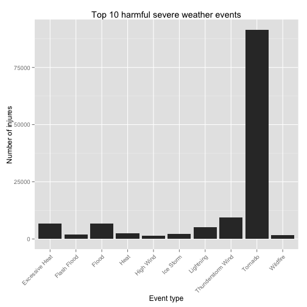
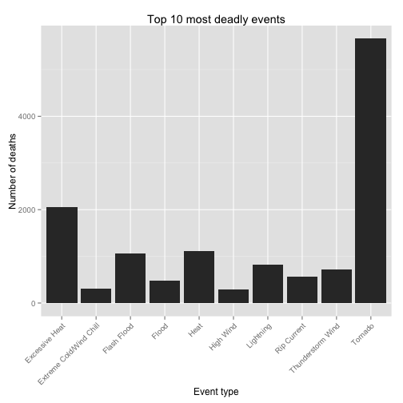
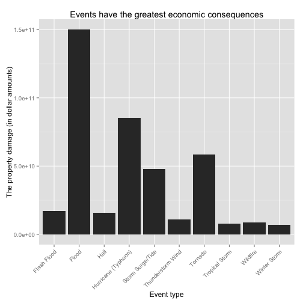

Exploration of the NOAA Storm Database, and which types of meteorological events are most harmful
========================================================================================

## Synopsis

The target of this analysis is to find out which metereological events cause the most harmful effects for human health and have the greatest economic consequences in terms of property damage. For the research of given objectives was used the U.S. National Oceanic and Atmospheric Administration's storm database from the past 60 years. It turned out that tornado has been most harmful metereological event which have caused over 90000 direct injuries in the last 60 years and flooding has had the greatest economic consequences with over 150 billion dollars in property damages.

## Data Processing

### Loading data

The data got downloaded from [source](https://d396qusza40orc.cloudfront.net/repdata%2Fdata%2FStormData.csv.bz2) and stored as `stormData.csv` file at the disk in the current working directory.


```r
data.url <- "http://d396qusza40orc.cloudfront.net/repdata%2Fdata%2FStormData.csv.bz2"
file.csv <- "stormData.csv"

if (!exists("storm") && file.exists(file.csv)) storm <- read.csv(file.csv, na.strings = "")

if (!file.exists(file.csv)) {
    file.tmp <- tempfile()
    
    download.file(data.url, destfile = file.tmp, method = "curl")
    conn <- bzfile(file.tmp)
    
    storm <- read.csv(conn, na.strings = "")
    write.csv(storm, file = file.csv)
    
    close(conn)
    file.remove(file.tmp)
}
```


The dataframe `storm` contains the 902,297 observation of 37 variables.

```r
dim(storm)
```

```
## [1] 902297     38
```


### Preprocessing

Pull out the necessary variables for estimating the harmful effect and economic consequences of the events included in the NOAA dataset.


```r
interest <- c("EVTYPE", "FATALITIES", "INJURIES", "PROPDMG", "PROPDMGEXP")
storm.short <- storm[, interest]
```


The `EVTYPE` variable at the `storm` dataframe is very untidy and has 985 levels. Meanwhile the National Weather Service Storm Data Documentation specifies 48 permitted events. First of all, lets reduce count of levels into 48 by the script [cleaning_storm_data.R](https://github.com/art2art/reproducible_research_2/blob/master/cleanStorm.R). The scripts contains `cleanStorm` function which tidies variables of interest - `EVTYPE` and `PROPDMGEXP`.


```r
source("cleanStorm.R")
storm.short <- cleanStorm(storm.short)
```


Add new necessary variable `ECONOMICDAMAGE` for estimating economic damage.


```r
storm.short$ECONOMICDAMAGE <- storm.short$PROPDMGEXP * storm.short$PROPDMG
```


Finally, create a new dataset adapted for futher data analysis. The new dataset contains total number of injured people, total number of died people and total estimate of damage in dollars per severe weather events.


```r
loss <- ddply(storm.short, ~EVTYPE, summarise, economicdamage = sum(ECONOMICDAMAGE, 
    na.rm = TRUE), fatalities = sum(FATALITIES, na.rm = TRUE), injures = sum(INJURIES, 
    na.rm = TRUE))
```


### Results

Top 10 harmful severe weather events with respect to population health.


```r
top10.injures <- arrange(df = loss, desc(injures))[1:10, ]
format(top10.injures, scientific = F)
```

```
##               EVTYPE economicdamage fatalities injures
## 1            Tornado    58593098230       5661   91407
## 2  Thunderstorm Wind    10970557630        714    9510
## 3              Flood   150129365500        482    6794
## 4     Excessive Heat        7869200       2059    6749
## 5          Lightning      933732280        817    5231
## 6               Heat       12257050       1114    2479
## 7          Ice Storm     3950832310         96    2208
## 8        Flash Flood    16991233460       1065    1880
## 9           Wildfire     8496628500         90    1608
## 10         High Wind     5992380960        295    1476
```


Make a barplot of top 10 harmful severe weather events with respect to population health.


```r
p <- ggplot(top10.injures, aes(x = EVTYPE, y = injures))
p <- p + geom_bar(stat = "identity")
p <- p + xlab("Event type") + ylab("Number of injures")
p <- p + ggtitle("Top 10 harmful severe weather events")
p <- p + theme(axis.text.x = element_text(angle = 45, hjust = 1))
p
```

 


Top 10 most deadly severe weather events.


```r
top10.fatalities <- arrange(df = loss, desc(fatalities))[1:10, ]
format(top10.fatalities, scientific = F)
```

```
##                     EVTYPE economicdamage fatalities injures
## 1                  Tornado    58593098230       5661   91407
## 2           Excessive Heat        7869200       2059    6749
## 3                     Heat       12257050       1114    2479
## 4              Flash Flood    16991233460       1065    1880
## 5                Lightning      933732280        817    5231
## 6        Thunderstorm Wind    10970557630        714    9510
## 7              Rip Current         163000        572     529
## 8                    Flood   150129365500        482    6794
## 9  Extreme Cold/Wind Chill      133290400        316     260
## 10               High Wind     5992380960        295    1476
```


Make a barplot of top 10 most deadlyevents.


```r
p <- ggplot(top10.fatalities, aes(x = EVTYPE, y = fatalities))
p <- p + geom_bar(stat = "identity")
p <- p + xlab("Event type") + ylab("Number of deaths")
p <- p + ggtitle("Top 10 most deadly events")
p <- p + theme(axis.text.x = element_text(angle = 45, hjust = 1))
p
```

 


Top 10 events having the greatest economic consequences.


```r
top10.economic <- arrange(df = loss, desc(economicdamage))[1:10, ]
format(top10.economic, scientific = F)
```

```
##                 EVTYPE economicdamage fatalities injures
## 1                Flood   150129365500        482    6794
## 2  Hurricane (Typhoon)    85356410010        135    1333
## 3              Tornado    58593098230       5661   91407
## 4     Storm Surge/Tide    47965274000         28      45
## 5          Flash Flood    16991233460       1065    1880
## 6                 Hail    15975650720         15    1372
## 7    Thunderstorm Wind    10970557630        714    9510
## 8             Wildfire     8496628500         90    1608
## 9       Tropical Storm     7714390550         66     383
## 10        Winter Storm     6749497250        217    1353
```


Make a barplot of top 10 events of greatest economic consequences.


```r
p <- ggplot(top10.economic, aes(x = EVTYPE, y = economicdamage))
p <- p + geom_bar(stat = "identity")
p <- p + xlab("Event type") + ylab("The property damage (in dollar amounts)")
p <- p + ggtitle("Events have the greatest economic consequences")
p <- p + theme(axis.text.x = element_text(angle = 45, hjust = 1))
p
```

 


## Conclusion

Tornado together with  is the most harmful  which has caused over 90,000 injuries in the last 60 years. Thunderstorm wind, flood, excessive heat, and lighting were among the most harmful events following tornadoes. Likewise, most deadly events were caused also by tornadoes, with about 5,600 deaths in the past 60 years. Excessive heat, heat, flash flood, and lighting were among the most deadly events following tornadoes. Finally, flooding had the greatest economic consequences, with over 150 billion dollars in property damages. Other hydrometereological events that caused great property damage were hurricanes, tornadoes, storm surges/tides, and flash flooding.


